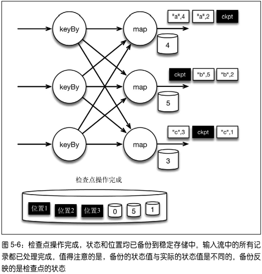

## 第1章 为什么选择Flink

**流数据更真实地反映了我们的生活方式**：许多系统都会产生连续的事件流，如GPS信号，金融交易，网络流量，机器日志和传感器等。如果能够高效地分析大规模流数据，我们对上述系统的理解将会更清楚、更快速。

**有限集**：目前企业常见的数据架构仍旧假设数据是有头有尾的有限集，因为与有限集匹配的数据存储及处理系统建起来比较简单。但是，这样做无疑给那些天然的流式场景人为地加了限制。

**数据一致性和事件发生顺序**：随着大规模数据在各行各业中出现，难度越来越大。这是一个属于物理学范畴的难题：在大型分布式系统中，数据一致性和对事件发生顺序的理解必然都是有限的。

在这样的背景下，Apache Flink（以下简称 Flink）应运而生。作为在公共社区中诞生的开源软件，Flink 为大容量数据提供流处理，并用同一种技术实现批处理。

### 1.1 流处理欠佳的后果

#### 1.1.1 零售业和市场营销

在现代零售业中，网站点击量就代表了销量。网站获得的点击数据可能是大量、连续、不均匀的。用以往的技术很难处理好如此规模的数据。仅是构建批量系统处理这些数据流就很有挑战性：结果很可能是需要一个庞大且杂的系统。并且，传统的做法还会带来数据丢失、延迟、错误的聚合结果等问题。

- 不准确的点击量：导致广告投放报价和业绩数字不准确
- 大规模实时数据处理失败：航空公司出现大面积的服务中断
- 实时推荐系统

#### 1.1.2 物联网

物联网是流数据被普遍应用的领域。在物联网中，低延迟的数据传输和处理，以及准确的数据分析通常很关键。各类仪器中的传感器频繁地获得测量数据，并将它们以流的形式传输至数据中心。在数据中心内，实时或者接近实时的应用程序将更新显示板，运行机器学习模型，发布警告，并就许多不同的服务项目提供反馈。

- 高速列车系统：保证行车安全避免事故发生
- 智能汽车：共享实时路况信息
- 智能计量表：机器学习模型来检测设备故障或者窃电等使用异常

#### 1.1.3 电信业

1. 它广泛地应用了基于各种目的而产生的跨地域的事件流数据。
2. 如果电信公司不能很好地处理流数据，就不能在某个移动通信基站出现流量高峰前预先将流量分配给其他的基站，也不能在断电时快速做出反应。
3. 通过处理流数据来进行异常检测，如检测通话中断或者设备故障，对于电信业来说至关重要。

#### 1.1.4 银行和金融

因为流处理做得不好而给银行以及金融业带来的潜在问题是极其显著的。从事零售业务的银行不希望客户交易被延迟或者因为错误统计而造成账户余额出错。曾经银行需要在下午早早关门进行结算，这样才能保证第二天营业之前算出准确的账。这种批量作业的营业模式早已消失。

> 在许多情况下，人们希望用低延迟或者实时的流处理来获得数据的高时效性，前提是流处理本身是准确且高效的。

### 1.2 连续事件处理的目标

能够以非常低的延迟处理数据，这并不是流处理的唯一优势。人们希望流处理**不仅做到低延迟和高吞吐，还可以处理中断**。

优秀的流处理技术应该能使系统在崩溃之后重新启动，并且产出准确的结果，优秀的**流处理技术可以容错，而且能保证 exactly-once** 。同时获得这种程度的容错性所采用的技术还需要满足以下几点：

- 要在没有数据错误的情况下**不产生太大的开销**
- 能够基于**事件发生的时间**（而不是随意地设置处理间隔）来保证按照**正确的顺序跟踪事件**
- 对于开发人员而言，不论是写代码还是修正错误，系统都要容易操作和维护
- 系统生成的结果需要与事件实际发生的顺序一致，比如能够处理乱序事件流
- 以及能够准确地替换流数据（在审计或者调试时很有用）

### 1.3 流处理技术演变

将连续的实时数据和有限批次的数据分开处理可以使系统构建工作变得更加简单，但是这种做法将管理两套系统的复杂性留给了系统用户。

##### Storm

Apache Storm 项目（以下简称 Storm）是流处理先锋。Storm 提供了低延迟的流处理，但是它为实时性付出了一些代价：很难实现高吞吐，并且其正确性没能达到通常所需的水平。换句话说，它并不能保证 exactly-once；即便是它能够保证的正确性级别，其开销也相当大。

##### Lambda 架构

**分布式文件系统**：对低成本规模化的需求促使人们开始使用分布式文件系统，例如 HDFS和基于批量数据的计算系统（MapReduce 作业）。但是这种系统很难做到低延迟。

**实时流处理技术**：用 Storm 开发的实时流处理技术可以帮助解决延迟性的问题，但并不完美。其中的一个原因是，Storm 不支持 exactly-once 语义，因此不能保证状态数据的正确性，另外它也不支持基于事件时间的处理。

将上述两个方案结合起来，既保证低延迟，又保障正确性。这个方法被称作 Lambda 架构，它通过批量 MapReduce 作业提供了虽有些延迟但是结果准确的计算，同时通过Storm 将最新数据的计算结果初步展示出来。

基于 MapReduce 和 HDFS 的 Lambda 系统有一个长达数小时的时间窗口，在这个窗口内，由于实时任务失败而产生的不准确的结果会一直存在。

Lambda 架构需要对同样的业务逻辑进行两次编程：批量计算的系统和流式计算的系统。针对同一个业务问题产生了两个代码库，各有不同的漏洞。这种系统实际上非常难维护。

##### 计算状态

若要依靠多个流事件来计算结果，必须将数据从一个事件保留到下一个事件。这些保存下来的数据叫作计算的状态。准确处理状态对于计算结果的一致性至关重要。在故障或中断之后能够继续准确地更新状态是容错的关键。

##### Spark

将连续事件中的流数据分割成一系列微小的批量作业。如果分割得足够小（即所谓的微批处理作业），计算就几乎可以实现真正的流处理。因为存在延迟，所以不可能做到完全实时，但是每个简单的应用程序都可以实现仅有几秒甚至几亚秒的延迟。

使用微批处理方法，可以实现 exactly-once 语义，从而保障状态的一致性。如果一个微批处理作业失败了，它可以重新运行。这比连续的流处理方法更容易。

**缺点：**

- 通过间歇性的批处理作业来模拟流处理，会导致开发和运维相互交错。
- 完成间歇性的批处理作业所需的时间和数据到达的时间紧密耦合，任何延迟都可能导致不一致（或者说错误）的结果
- 这种技术的潜在问题是，时间由系统中生成小批量作业的那一部分全权控制。
- 使用这种方法的计算有着糟糕的用户体验，尤其是那些对延迟比较敏感的作业，而且人们需要在写业务代码时花费大量精力来提升性能

##### Flink


### 1.4 初探Flink

Apache Flink 是为分布式、高性能、随时可用以及准确的流处理应用程序打造的开源流处理框架。

Flink不仅能提供同时支持高吞吐和 exactly-once 语义的实时计算，还能提供批量数据处理

#### 流处理与批处理

Flink 将批处理（即处理有限的静态数据）视作一种特殊的流处理

Flink 分别提供了面向流处理的接口（DataStream API）和面向批处理的接口（DataSet API）。因此，Flink 既
可以完成流处理，也可以完成批处理。


Flink 提供了封装在 Runtime执行引擎之上的 API，以帮助用户更方便地生成流式计算程序。Flink 提供了用于流处理的 DataStream API 和用于批处理的 DataSet API。值得注意的是，尽管 Flink Runtime 执行引擎是基于流处理的，但是 DataSet API 先于DataStream API 被开发出来，这是因为工业界对无限流处理的需求在 Flink诞生之初并不大。

Flink 能够自动地确保在发生机器故障或者其他错误时计算能持续进行，或者在修复 bug 或进行版本升级后有计划地再执行一次。

### 1.5 生产环境中的Flink

阿里巴巴集团

### 1.6 Flink的适用场景

与其说流数据是特别的，倒不如说它是自然的——只不过从前我们没有流处理能力，只能做一些特殊的处理才能
真正地使用流数据，比如将流数据攒成批量数据再处理，不然无法进行大规模的计算。使用流数据并不新鲜，新鲜的是我们有了新技术，从而可以大规模、灵活、自然和低成本地使用它们。


## 第2章 流处理架构

Flink 扩展了“流处理”这个概念的范围，流处理不仅指实时、低延迟的数据分析，还指各类数据应用程序。其中，有些应用程序基于流处理器实现，有些基于批处理器实现，有些甚至基于事务型数据库实现。

### 2.1 传统架构与流处理架构

**传统架构**

- 对于后端数据而言，典型的传统架构是采用一个中心化的数据库系统，用于存储事务性数据。换句话说，数据库拥有“新鲜”（或者说“准确”）的数据，这些数据反映了当前的业务状态，需要新鲜数据的应用程序都依靠数据库实现。
- 分布式文件系统则用来存储不需要经常更新的数据，它们也往往是大规模批量计算所依赖的数据存储方式。

随着大型分布式系统中的计算复杂度不断上升，经常遇到以下问题：

- 在许多项目中，从数据到达到数据分析所需的**工作流程太复杂、太缓慢**。
- **数据库是唯一正确的数据源**，每一个应用程序都需要通过访问数据库来获得所需的数据。
- 采用这种架构的系统拥有**非常复杂的异常问题处理方法**，当出现异常问题时，很难保证系统还能很好地运行。
- 需要通过**在大型分布式系统中不断地更新来维持一致的全局状态**，随着系统规模扩大，维持实际数据与状态数据间的一致性变得越来越困难。**流处理架构则只需要维持本地的数据一致性即可**。

**流处理架构**

- 数据记录持续地从数据源流向应用程序，并在各个应用程序间持续流动。
- 没有一个数据库来集中存储全局状态数据，而是共享且永不停止的流数据，它是唯一正确的数据源，记录了业务数据的历史。
- 在流处理架构中**每个应用程序都有自己的数据**，这些数据采用本地数据库或分布式文件进行存储。

### 2.2 消息传输层和流处理层

**消息传输层**从各种数据源采集连续事件产生的数据，并传输给订阅了这些数据的应用程序和服务。

**流处理层**有 3 个用途：

- 持续地将数据在应用程序和系统间移动；
- 聚合并处理事件；
- 在本地维持应用程序的状态。


**消息传输层的重要性**

在设计高效的流处理架构时，不仅流处理器的选择会造成架构的巨大差异，消息传输层也很关键，现代系统之所以更容易处理大规模的流数据，其中很大一部分原因就是消息传输方式的改进，以及流处理器与消息传输系统的交互方式的改变。

### 2.3 消息传输层的理想功能

#### 2.3.1 兼具高性能和持久性

- 为了设计新一代的流处理架构，兼具高性能和持久性对于消息传输系统来说至关重要。
- 消息传输层的一个作用是作为流处理层上游的安全队列——它相当于缓冲区，可以将事件数据作为短期数据保留起来，以防数据处理过程发生中断。
- 具有持久性的好处之一是消息可以重播，这个功能使得像 Flink 这样的处理器能对事件流中的某一部分进行重播和再计算
- 正是由于消息传输层和流处理层相互作用，才使得像 Flink 这样的系统有了准确处理和重新处理数据的能力

#### 2.3.2 将生产者和消费者解耦

- 高效的消息传输技术，可以从多个源收集数据，并使这些数据可供多个服务或应用程序使用。
- 事件数据只能基于给定的偏移量从消息队列中按顺序读出，生产者并不向所有消费者自动广播，而是采用发布订阅的模式。
- 消费者订阅感兴趣的主题——意味着消息立刻到达，但并不需要被立刻处理。
- 在消息到达时，消费者并不需要处于运行状态，而是可以根据自身的需求在任何时间使用数据。这样一来，添加新的消费者和生产者也很容易。
- 采用解耦的消息传输系统很有意义，因为它能支持微服务，也支持将处理步骤中的实现过程隐藏起来，从而允许自由地修改实现过程。


### 2.4 支持微服务架构的流数据

**什么是微服务**

- 微服务方法指的是将**大型系统的功能分割成通常具有单一目的的简单服务**，从而使小型团队可以轻松地构建和维护这些服务。
- 即使是超大型组织，也可以用这种设计实现敏捷。
- 若要使整个系统正常工作，各服务之间因通信而产生的连接必须是轻量级的。

消息传输系统一方面将生产者和消费者解耦，另一方面又有足够高的吞吐量，并且能够满足像 Flink 这样的高性能流处理器，这种系统非常适合用于构建微服务。

#### 2.4.1 数据流作为中心数据源

- 流处理架构的**核心是使各种应用程序互连在一起的消息队列**，流处理器从消息队列中订阅数据并加以处理。
- 处理后的数据可以流向另一个消息队列，这样一来，其他应用程序都可以共享流数据。
- 在一些情况下，处理后的数据会被存放在本地数据库中。


#### 2.4.2 欺诈检测：流处理架构用例

基于流处理的微服务架构有着强大的灵活性，特别是当同一份数据被用于不同的场景时，其灵活性更为明显。以信用卡服务提供商的欺诈检测项目为例。项目的目标是尽可能快地识别可疑的刷卡行为，从而阻止盗刷，并
将损失降到最低。

许多销售终端（POS 机 1~n）请求欺诈检测器判定是否有欺诈行为。这些来自销售终端的询问需要立即被应答，因此在销售终端与欺诈检测器之间形成了询问与应答的交互。


**传统的欺诈检测模型**

将包含每张信用卡最后一次刷卡地点的文件直接存储在数据库中。但在这样的集中式数据库设计中：

- 其他消费者并不能轻易使用刷卡行为的数据，因为访问数据库可能会影响欺诈检测系统的正常工作；
- 在没有经过认真仔细的审查之前，其他消费者绝不会被授权更改数据库。
- 将导致整个流程变慢，因为必须仔细执行各种检查，以避免核心的业务功能受到破坏或影响。

**流处理架构**

- 将欺诈检测器的输出发送给外部的消息队列，再由如 Flink 这样的流处理器更新数据库，而不是直接将输出发送给数据库。
- 这使得刷卡行为的数据可以通过消息队列被其他服务使用，例如刷卡行为分析器。上一次刷卡行为的数据被存储在本地数据库中，不会被其他服务访问。
- 这样的设计避免了因为增加新的服务而带来的过载风险。

#### 2.4.3 给开发人员带来的灵活性

假设开发团队正试图改进欺诈检测模型并加以评估。

- 刷卡行为产生的消息流可以被新模型采用，而完全不影响已有的检测器。
- 新增加一个数据消费者的开销几乎可以忽略不计，同时只要合适，数据的历史信息可以保存成任何一种格式，并且使用任意的数据库服务。
- 如果刷卡行为队列中的消息被设计成业务级别的事件，而不是数据库表格的更新，那么消息的形式和内容都会非常稳定。

### 2.5 不限于实时应用程序

**实时仪表盘**：虽然低延迟性很重要，但是实时应用程序只是众多流数据消费者中的一种。流数据的应用很广泛，比如，流处理应用程序可以通过订阅消息队列中的流数据来实时更新仪表盘（如图 2-5 中的 A 组消费者）。

**消息重播**：持久化的消息可以被重播，这一特性使许多用户获益（如图 2-5 中的 C 组消费者）。在本例中，消息流成为了可审计的日志，或者长期的事件历史。能够重现的历史非常有用，比如可以在工业安全分析中作为预知维护模型的一部分输入，也可以在医学或环境科学领域用于回顾性研究。

**聚合分析**：应用程序使用消息队列中的数据更新本地数据库或者搜索文件（如图 2-5 中的 B 组消费者）。消息队列中的数据往往必须被流处理器聚合或者分析并转换之后，才会输出到数据库中，这是 Flink 擅长的另一个场景。


### 2.6 流的跨地域复制

- 许多关键的业务系统依靠跨数据中心的一致性，它们不仅需要高效的流处理层，更需要消息传输层拥有可靠的跨地域复制能力。
- 数据中心之间的数据复制需要保存消息偏移量，因为它使得任何数据中心的更新都可以被传播到其他数据中心，且允许双向和循环的数据复制。如果消息偏移量没有被保存，那么另一个数据中心就无法可靠地重启程序。
- 如果不允许其他数据中心更新数据，那么就必须设计可靠的主节点。
- 循环复制则可以避免复制过程出现单点故障。

**MapR Streams**

MapR Streams 循环复制的基本原理：

1. 许多流主题被收集在一级数据结构中，该结构也叫作流，它与文件、表格和目录共存于 MapR 的数据平台
2. 这些流成为管理数据复制、生存时间和访问权限的基础
3. 在流中针对主题所做的变更将被贴上源集群的 ID，避免它被无限地循环复制
4. 这些变更被依次传播到其他集群中，并且保留所有的消息偏移量


## 第3章 Flink的用途

### 3.1 不同类型的正确性

#### 3.1.1 符合产生数据的自然规律

流处理器（尤其是 Flink）的正确性体现在计算窗口的定义符合数据产生的自然规律


由微批处理方法得到的计算窗口是人为设置的，因此很难与会话窗口吻合。使用 Flink 的流处理 API，可以更灵活地定义计算窗口，因此这个问题迎刃而解。


Flink 能做到这一点的根本原因是，它可以根据真实情况设置计算窗口。

#### 3.1.2 事件时间

一般而言，流处理架构不常采用事件时间，Flink 能够完美地做到这一点，这在实现计算的正确性上非常有用。为了获得最佳的计算结果，系统需要能够通过数据找到事件发生的时间，而不是只采用处理时间。

使用一个 Flink 程序来计算以 1秒为计算窗口、每秒内正弦波的数值之和。正确的结果是 0。他比较了用处理时间划分窗口和用事件时间划分窗口的差别。采用处理时间时，结果总是或多或少地有些偏差；采用事件时间时，则总是可以获得正确的结果。


与其他流处理系统相比，Flink 的一个优势就是能区分不同类型的时间。

#### 3.1.3 发生故障后仍保持准确

**状态**

1. 若想使计算保持准确，就必须跟踪计算状态。如果计算框架本身不能做到这一点，就必须由应用程序的开发人员来完成这个任务。
2. 连续的流处理很难跟踪计算状态，因为计算过程没有终点。实际上，对状态的更新是持续进行的

**检查点（checkpoint）**

1. 在每个检查点，系统都会记录中间计算状态，从而在故障发生时准确地重置。
2. 这一方法使系统以低开销的方式拥有了容错能力——当一切正常时，检查点机制对系统的影响非常小。
3. 检查点也是 Flink 能够按需重新处理数据的关键所在。毕竟，并不是只有在发生故障之后才会重新处理数据。比如，在运行新模型或者修复 bug 时，就可能需要重播并重新处理事件流数据。
4. Flink 的检查点特性在流处理器中是独一无二的，它使得Flink 可以准确地维持状态，并且高效地重新处理数据。

#### 3.1.4 及时给出所需结果

有些计算结果或许很准确，但是如果没有及时地取得结果，那么很难说它们是正确的，比如程序需要2个小时才能将实时路况结果返回，那么结果再准确也是无用的，哪怕只有 5 秒钟的延迟也足以造成麻烦，因为你可能已经拐错了弯。

可见，在某些情况下，极低的延迟非常重要，它决定了系统能够及时地给出所需结果，而不仅仅是完成计算，Flink 的实时且容错的流处理能力可以满足这类需求。

#### 3.1.5 使开发和运维更轻松

1. Flink 与用户交互的接口也有助于保障正确性，完备的语义简化了开发工作，进而降低了出错率
2. Flink 还承担了跟踪计算状态的任务，从而减轻了开发人员的负担，简化了编程工作，并提高了应用程序的成功率
3. 用同一种技术来实现流处理和批处理，大大地简化了开发和运维工作。

### 3.2 分阶段采用Flink

1. 尽管 Flink 拥有非常丰富的功能，并能处理极为复杂的数据，但是没有必要为了采用 Flink 而彻底抛弃其他技术。
2. 流处理架构可以分步来实现，先实现简单的应用程序，等到熟悉后再推广。

## 第4章 对时间的处理

### 4.1 采用批处理架构和Lambda架构计数

大规模的计数任务在实践中出人意料地困难，针对联机分析处理多维数据集的聚合或其他操作，都可以简单地归结为计数。

图 4-1 展示了如何采用传统的批处理架构实现计数任务。


这种架构完全可行，但是存在以下问题。

- 太多独立的部分。为了计算数据中的事件数，这种架构动用了太多系统。每一个系统都有学习成本和管理成本，还可能存在 bug。
- **对时间的处理方法不明确**。假设需要改为每 30 分钟计数一次。这个变动涉及工作流调度逻辑（而不是应用程序代码逻辑），从而使 DevOps 问题与业务需求混淆。
- **预警**。假设除了每小时计数一次外，还需要尽可能早地收到计数预警。为了做到这一点，可以在定期运行的批处理作业之外，引入 Storm 来采集消息流  。Storm 实时提供近似的计数，批处理作业每小时提供准确的计数。但是这样一来，就向架构增加了一个系统，以及与之相关的新编程模型。
- **乱序事件流**。在现实世界中，大多数事件流都是乱序的，即事件的实际发生顺序和数据中心所记录的顺序不一样,这意味着本属于前一批的事件可能被错误地归入当前一批。批处理架构很难解决这个问题。
- **批处理作业的界限不清晰**。在该架构中，“每小时”的定义含糊不清，分割时间点实际上取决于不同系统之间的交互。充其量也只能做到大约每小时分割一次，而在分割时间点前后的事件既可能被归入前一批，也可能被归入当前一批。


### 4.2 采用流处理架构计数


```java
DataStream<LogEvent> stream = env 
  // 通过Kafka生成数据流 
  .addSource(new FlinkKafkaConsumer(...)) 
  // 分组 
  .keyBy("country") 
  // 将时间窗口设为60分钟 
  .timeWindow(Time.minutes(60)) 
  // 针对每个时间窗口进行操作 
  .apply(new CountPerWindowFunction());
```

流处理区别于批处理最主要的两点是：流即是流，不必人为地将它分割为文件；时间的定义被明确地写入应用程序代码（如以上代码的时间窗口），而不是与摄取、计算和调度等过程牵扯不清。

#### 流处理系统中的批处理

**Storm Trident 微批处理**

先创建一个大的 Storm 事件，其中包含固定数量的子事件；然后将这些聚合在一起的子事件用持续运行的Storm 拓扑处理

**Spark Streaming 微批处理**

Spark Streaming 的微批处理架构和批处理架构本质上是一致的，只不过对用户隐藏了前两步（摄取和存储），并将每份微批数据用预写日志（而不是文件）的形式存储在内存中。

**流处理器的微批处理技术**

包括 Flink 在内的所有现代流处理器在内部都使用了某种形式的微批处理技术，在 shuffle 阶段将含有多个事件的缓冲容器通过网络发送，而不是发送单个事件。

流处理系统中的批处理必须符合以下两点要求：

- 批处理只作为提高系统性能的机制。批量越大，系统的吞吐量就越大。
- 为了提高性能而使用的批处理必须完全独立于定义窗口时所用的缓冲，或者为了保证容错性而提交的代码，也不能作为 API 的一部分。否则，系统将受到限制，并且变得脆弱且难以使用。

应用程序开发人员和数据处理系统的用户不需要考虑系统是否可以执行微批处理以及如何执行，而是需要考虑系统是否可以处理乱序事件流以及不一致的窗口，是否可以在提供准确的聚合结果之外还提供预警，以及是否可以准确地重播历史数据；还需要考虑系统的性能特征（低延迟和高吞吐），以及如何在发生故障时保证系统持续运行。

### 4.3 时间概念

在流处理中，主要有两个时间概念：

- 事件时间，即事件实际发生的时间。更准确地说，每一个事件都有一个与它相关的时间戳，并且时间戳是数据记录的一部分（比如手机或者服务器的记录）。事件时间其实就是时间戳。
- 处理时间，即事件被处理的时间。处理时间其实就是处理事件的机器所测量的时间。
- 摄取时间，也叫作进入时间。它指的是事件进入流处理框架的时间。缺乏真实事件时间的数据会被流处理器附上时间戳，即流处理器第一次看到它的时间（这个操作由 source 函数完成，它是程序的第一个处理节点）。

**乱序数据**

1. 在现实世界中，许多因素（如连接暂时中断，不同原因导致的网络延迟，分布式系统中的时钟不同步，数据速率陡增，物理原因，或者运气差）使得事件时间和处理时间存在偏差（即事件时间偏差）。
2. 事件时间顺序和处理时间顺序通常不一致，这意味着事件以乱序到达流处理器。

**处理时间和事件事件的应用场景**

1. 有些应用程序（如一些预警应用程序）需要尽可能快地得到结果，即使有小的误差也没关系。它们不必等待迟到的事件，因此适合采用处理时间语义。
2. 其他一些应用程序（如欺诈检测系统或者账单系统）则对准确性有要求：只有在时间窗口内发生的事件才能被算进来。对于这些应用程序来说，事件时间语义才是正确的选择。
3. 也有两者都采用的情况，比如既要准确地计数，又要提供异常预警。


Flink 允许用户根据所需的语义和对准确性的要求选择采用事件时间、处理时间或摄取时间定义窗口。当采用事件时间定义窗口时，应用程序可以处理乱序事件流以及变化的事件时间偏差，并根据事件实际发生的时间计算出有意义的结果。

### 4.4 窗口

窗口是一种机制，它用于将许多事件按照时间或者其他特征分组，从而将每一组作为整体进行分析（比如求和）。

#### 4.4.1 时间窗口

时间窗口是最简单和最有用的一种窗口。它支持滚动和滑动

**滚动窗口**


**滑动窗口**


```java
stream.timeWindow(Time.minutes(1))   // 一分钟滚动窗口的定义如下
stream.timeWindow(Time.minutes(1), Time.seconds(30))//每半分钟滑动一次的一分钟滑动窗口    
```

#### 4.4.2 计数窗口

Flink 支持的另一种常见窗口叫作计数窗口。采用计数窗口时，分组依据不再是时间戳，而是元素的数量。

```java
stream.countWindow(4) 
stream.countWindow(4, 2)
```

虽然计数窗口有用，但是其定义不如时间窗口严谨，因此要谨慎使用。时间不会停止，而且时间窗口总会“关闭”。但就计数窗口而言，假设其定义的元素数量为 100，而某个 key 对应的元素永远达不到 100 个，那么窗口就永远不会关闭，被该窗口占用的内存也就浪费了。

#### 4.4.3 会话窗口

1. Flink 支持的另一种很有用的窗口是会话窗口，会话指的是活动阶段，其前后都是非活动阶段。
2. 会话需要有自己的处理机制，因为它们通常没有固定的持续时间，或者没有固定的交互次数。
3. 在 Flink 中，会话窗口由超时时间设定，即希望等待多久才认为会话已经结

```java
// 如果用户处于非活动状态长达 5 分钟，则认为会话结束
stream.window(SessionWindows.withGap(Time.minutes(5))
```

#### 4.4.4 触发器

触发器控制生成结果的时间，即何时聚合窗口内容并将结果返回给用户，每一个默认窗口都有一个触发器。

例如，采用事件时间的时间窗口将在收到水印时被触发。

#### 4.4.5 窗口实现

在 Flink 内部，所有类型的窗口都由同一种机制实现

- 开窗机制与检查点机制完全分离。这意味着窗口时长不依赖于检查点间隔。事实上，窗口完全可以没有“时长”。
- 高级用户可以直接用基本的开窗机制定义更复杂的窗口形式。

### 4.5 时空穿梭

流处理架构的一个核心能力是时空穿梭，这意味着将数据流倒回至过去的某个时间，重新启动处理程序

实时流处理总是在处理最近的数据（即图中“当前时间”的数据），历史流处理则从过去开始，并且可以一直处理至当前时间。


若要按时间回溯并正确地重新处理数据，流处理器必须支持事件时间。

**事件时间保证确定性**

如果窗口的设定是根据系统时间而不是时间戳，那么每次运行同样的程序，都会得到不同的结果。事件时间使数据处理结果具有确定性，因为用同一组数据运行同样的程序，会得到相同的结果。

### 4.6 水印

当计算基于事件时间时，如何判断所有事件是否都到达，以及何时计算和输出窗口的结果呢？换言之，如何追踪事件时间，并知晓输入数据已经流到某个事件时间了呢？

Flink 通过水印来推进事件时间。水印是嵌在流中的常规记录，计算程序通过水印获知某个时间点已到。对于上述一分钟滚动窗口，假设水印标记时间为 10:01:00，那么收到水印的窗口就知道不会再有早于该时间的记录出现，因为所有时间戳小于或等于该时间的事件都已经到达。

水印使事件时间与处理时间完全无关。迟到的水印（“迟到”是从处理时间的角度而言）并不会影响结果的正确性，而只会影响收到结果的速度。

#### 水印是如何生成的

1. 在 Flink 中，水印由应用程序开发人员生成
2. 完美的水印永远不会错：时间戳小于水印标记时间的事件不会再出现。在特殊情况下（例如非乱序事件流），最近一次事件的时间戳就可能是完美的水印。
3. 启发式水印则相反，它只估计时间，因此有可能出错，即迟到的事件（其时间戳小于水印标记时间）晚于水印出现。
4. 针对启发式水印，Flink 提供了处理迟到元素的机制。
5. 如果水印迟到得太久，收到结果的速度可能就会很慢，解决办法是在水印到达之前输出近似结果（Flink 可以实现）。如果水印到达得太早，则可能收到错误结果，不过 Flink 处理迟到数据的机制可以解决这个问题。
6. 水印是唯一让我们直面乱序事件流并保证正确性的机制；否则只能选择忽视事实，假装错误的结果是正确的。

### 4.7 真实案例：爱立信公司的Kappa架构


为什么 Flink 对事件时间的支持很重要呢？有两个原因。

- 有助于准确地识别异常。时间对识别异常很重要。当许多日志事件在同一时间出现时，通常说明可能有错误发生。为了将这些事件正确地分组和归类，考虑它们的真实时间（而不是处理时间）很重要。
-  有助于采用流处理架构。在流处理架构中，所有的计算都由流处理器完成。升级应用程序的做法是将它们在流处理器中再次执行。用同一种计算运行两次同样的数据，必须得到同样的结果，这只有依靠事件时间操作才能实现。

## 第5章 有状态的计算

流式计算分为无状态和有状态两种情况。无状态的计算观察每个独立事件，并根据最后一个事件输出结果。


正确地实现有状态的计算比实现无状态的计算难得多。旧的流处理系统并不支持有状态的计算，而新一代的流处理系统则将状态及其正确性视为重中之重。

### 5.1 一致性

当在分布式系统中引入状态时，自然也引入了一致性问题。一致性实际上是“正确性级别”的另一种说法，即在成功处理故障并恢复之后得到的结果，与没有发生任何故障时得到的结果相比，前者有多正确，在流处理中，一致性分为 3 个级别：

-  at-most-once：这其实是没有正确性保障的委婉说法——故障发生之后，计数结果可能丢失。
- at-least-once：这表示计数结果可能大于正确值，但绝不会小于正确值。也就是说，计数程序在发生故障后可能多算，但是绝不会少算。
- exactly-once：这指的是系统保证在发生故障后得到的计数结果与正确值一致。

第一代流处理器（如 Storm 和 Samza）刚问世时只保证 at-least-once，因为：

- 保证 exactly-once 的系统实现起来更复杂
-  流处理系统的早期用户愿意接受框架的局限性，并在应用层想办法弥补（例如使应用程序具有幂等性，或者用批量计算层再做一遍计算）。

保证 exactly-once 付出较大代价

- 为了保证 exactly-once，这些系统无法单独地对每条记录运用应用逻辑，而是同时处理多条（一批）记录，保证对每一批的处理要么全部成功，要么全部失败。这就导致在得到结果前，必须等待一批记录处理结束。
- 用户经常不得不使用两个流处理框架（一个用来保证 exactly-once，另一个用来对每个元素做低延迟处理），结果使基础设施更加复杂。
- 用户不得不在保证 exactly-once 与获得低延迟和效率之间权衡利弊


Flink 的一个重大价值在于，它既保证了 exactly-once，也具有低延迟和高吞吐的处理能力。

### 5.2 检查点：保证exactly-once

Flink 使用一种被称为“检查点”的特性，在出现故障时将系统重置回正确状态，以此来保证 exactly-once


如图 5-2 所示。你捏住珠子，边数边拨，每拨过一颗珠子就给总数加一。你的朋友也这样数他们手中的珠子。当你分神忘记数到哪里时，怎么办呢？

在项链上每隔一段就松松地系上一根有色皮筋，将珠子分隔开；当珠子被拨动的时候，皮筋也可以被拨动；然后，
你安排一个助手，让他在你和朋友拨到皮筋时记录总数。用这种方法，当有人数错时，就不必从头开始数。相反，你向其他人发出错误警示，然后你们都从上一根皮筋处开始重数，助手则会告诉每个人重数时的起始数值，例如在粉色皮筋处的数值是多少。

Flink 检查点的作用就类似于皮筋标记。数珠子这个类比的关键点是：对于指定的皮筋而言，珠子的相对位置是确定的；这让皮筋成为重新计数的参考点。

Flink 检查点的核心作用是确保状态正确，即使遇到程序中断，也要正确。

```scala
val stream: DataStream[(String, Int)] = ... 
 
val counts: DataStream[(String, Int)] = stream 
  .keyBy(record => record._1) 
  .mapWithState((in: (String, Int), count: Option[Int]) => 
    count match { 
      case Some(c) => ( (in._1, c + in._2), Some(c + in._2) ) 
      case None => ( (in._1, in._2), Some(in._2) ) 
    })
```

图 5-3 表示程序的初始状态：输入流中的 6 条记录被检查点屏障（checkpoint barrier）隔开，所有的 map 算子状态均为 0（计数还未开始）


当该程序处理输入流中的 6 条记录时，涉及的操作遍布 3 个并行实例（节点、CPU 内核等）。那么，检查点该如何保证 exactly-once 呢？
检查点屏障和普通记录类似。它们由算子处理，但并不参与计算，而是会触发与检查点相关的行为。当读取输入流的数据源（在本例中与 keyBy 算子内联）遇到检查点屏障时，它将其在输入流中的位置保存到稳定存储中,图 5-4 展示了这个过程。


检查点屏障像普通记录一样在算子之间流动。当 map 算子处理完前 3 条记录并收到检查点屏障时，它们会将状态以异步的方式写入稳定存储，如图 5-5所示。


当 map 算子的状态备份和检查点屏障的位置备份被确认之后，该检查点操作就可以被标记为完成，如图 5-6 所示。我们在无须停止或者阻断计算的条件下，在一个逻辑时间点（对应检查点屏障在输入流中的位置）为计算状态拍了快照。

当没有出现故障时，Flink 检查点的开销极小，检查点操作的速度由稳定存储的可用带宽决定。



如果检查点操作失败，Flink 会丢弃该检查点并继续正常执行，因为之后的某一个检查点可能会成功。虽然恢复时间可能更长，但是对于状态的保证依旧很有力。只有在一系列连续的检查点操作失败之后，Flink 才会抛出错误，因为这通常预示着发生了严重且持久的错误。


在这种情况下，Flink 会重新拓扑（可能会获取新的执行资源），将输入流倒回到上一个检查点，然后恢复状态值并从该处开始继续计算。

图 5-8 展示了这一重新处理过程。从上一个检查点开始重新计算，可以保证在剩下的记录被处理之后，得到的 map 算子的状态值与没有发生故障时的状态值一致。


Flink 检查点算法的正式名称是异步屏障快照（asynchronous barrier snapshotting）。该算法大致基于 Chandy-Lamport 分布式快照算法。

### 5.3 保存点：状态版本控制

1. 保存点与检查点的工作方式完全相同，只不过它由用户通过 Flink 命令行工具或者 Web 控制台手动触发，而不由 Flink 自动触发。
2. 和检查点一样，保存点也被保存在稳定存储中。
3. 保存点在明确的时间点保存应用程序状态的版本，这和用版本控制系统保存应用程序的版本很相似。


v.0 是某应用程序的一个正在运行的版本。我们分别在  $t_1$ 时刻和  $t_2$ 时刻触发了保存点。因此，可以在任何时候返回到这两个时间点，并且重启程序。更重要的是，可以从保存点启动被修改过的程序版本。


保存点可用于应对流处理作业在生产环境中遇到的许多挑战:

1. 应用程序代码升级：假设你在已经处于运行状态的应用程序中发现了一个 bug，并且希望之后的事件都可以用修复后的新版本来处理。通过触发保存点并从该保存点处运行新版本，下游的应用程序并不会察觉到不同（当然，被更新的部分除外）。
2. Flink 版本更新：Flink 自身的更新也变得简单，因为可以针对正在运行的任务触发保存点，并从保存点处用新版本的 Flink 重启任务。
3.  维护和迁移：使用保存点，可以轻松地“暂停和恢复”应用程序。这对于集群维护以及向新集群迁移的作业来说尤其有用。此外，它还有利于开发、测试和调试，因为不需要重播整个事件流。
4.  假设模拟与恢复：在可控的点上运行其他的应用逻辑，以模拟假设的场景，这样做在很多时候非常有用。
5.  A/B 测试：从同一个保存点开始，并行地运行应用程序的两个版本，有助于进行 A/B 测试。

### 5.4 端到端的一致性和作为数据库的流处理器


端到端的一致性，本质上有两种实现方法，用哪一种方法则取决于输出存储系统的类型，以及应用程序的需求

第一种方法是在 sink 环节缓冲所有输出，并在 sink 收到检查点记录时，将输出“原子提交”到存储系统。这种方法保证输出存储系统中只存在有一致性保障的结果，并且不会出现重复的数据。从本质上说，输出存储系统会参与 Flink 的检查点操作。要做到这一点，输出存储系统需要具备“原子提交”的能力。

第二种方法是急切地将数据写入输出存储系统，同时牢记这些数据可能是“脏”的，而且需要在发生故障时重新处理。如果发生故障，就需要将输出、输入和 Flink 作业全部回滚，从而将“脏”数据覆盖，并将已经写入输出的“脏”数据删除。注意，在很多情况下，其实并没有发生删除操作。例如，如果新记录只是覆盖旧纪录（而不是添加到输出中），那么“脏”数据只在检查点之间短暂存在，并且最终会被修正过的新数据覆盖。

这两种方法恰好对应关系数据库系统中的两种为人所熟知的事务隔离级别：已提交读（read committed）和未提交读（read uncommitted）。

- 已提交读保证所有读取（查询输出）都只读取已提交的数据，而不会读取中间、传输中或“脏”的数据。之后的读取可能会返回不同的结果，因为数据可能已被改变。
- 未提交读则允许读取“脏”数据；换句话说，查询总是看到被处理过的最新版本的数据。


### 5.5 Flink的性能


## 第6章 批处理：一种特殊的流处理

有限流处理，即从某一个时间点开始处理数据，然后在另一个时间点结束，如图 6-2 所示。输入数据可能本身是有限的（即输入数据集并不会随着时间增长），也可能出于分析的目的被人为地设定为有限集（即只分析某一个时间段内的事件）。


显然，有限流处理是无限流处理的一种特殊情况，它只不过在某个时间点停止而已。此外，如果计算结果不在执行过程中连续生成，而仅在末尾处生成一次，那就是批处理（分批处理数据）。


批处理是流处理的一种非常特殊的情况。在流处理中，我们为数据定义滑动窗口或滚动窗口，并且在每次窗口滑动或滚动时生成结果。

批处理则不同，我们定义一个全局窗口，所有的记录都属于同一个窗口。

```scala
// 负责每小时对某网站的访问者计数，并按照地区分组
val counts = visits 
  .keyBy("region") 
  .timeWindow(Time.hours(1)) 
  .sum("visits")
  
val counts = visits 
  .keyBy("region") 
  .window(GlobalWindows.create) 
  .trigger(EndOfTimeTrigger.create) 
  .sum("visits")  

val counts = visits 
  .groupBy("region") 
  .sum("visits")
```

### 6.1 批处理技术

从原则上说，批处理是一种特殊的流处理：当输入数据是有限的，并且只需要得到最终结果时，对所有数据定义一个全局窗口并在窗口里进行计算即可。


在流处理引擎之上，Flink 有以下机制：

- 检查点机制和状态机制：用于实现容错、有状态的处理
- 水印机制：用于实现事件时钟
- 窗口和触发器：用于限制计算范围，并定义呈现结果的时间

实现高效的批处理的机制：

- 用于调度和恢复的回溯法：由 Microsoft Dryad 引入，现在几乎用于所有批处理器
- 用于散列和排序的特殊内存数据结构：可以在需要时，将一部分数据从内存溢出到硬盘上
- 优化器：尽可能地缩短生成结果的时间

## 附录 其他资源

#### 进一步使用Flink

Flink 的网站：https://flink.apache.org。该网站有“快速入门”指南，通过例子教你如何使用 Flink 摄取和分析维基百科的编辑日志。只需花几分钟，你就可以开始编写你的第一个流处理程序了。

#### 消息传输：Kafka

推荐阅读由 Neha Narkhede、Gwen Shapira 和 Todd Palino 合著的书《Kafka 权威指南》