## 第1章 为什么选择Flink

**流数据更真实地反映了我们的生活方式**：许多系统都会产生连续的事件流，如GPS信号，金融交易，网络流量，机器日志和传感器等。如果能够高效地分析大规模流数据，我们对上述系统的理解将会更清楚、更快速。

**有限集**：目前企业常见的数据架构仍旧假设数据是有头有尾的有限集，因为与有限集匹配的数据存储及处理系统建起来比较简单。但是，这样做无疑给那些天然的流式场景人为地加了限制。

**数据一致性和事件发生顺序**：随着大规模数据在各行各业中出现，难度越来越大。这是一个属于物理学范畴的难题：在大型分布式系统中，数据一致性和对事件发生顺序的理解必然都是有限的。

在这样的背景下，Apache Flink（以下简称 Flink）应运而生。作为在公共社区中诞生的开源软件，Flink 为大容量数据提供流处理，并用同一种技术实现批处理。

### 1.1 流处理欠佳的后果

#### 1.1.1 零售业和市场营销

在现代零售业中，网站点击量就代表了销量。网站获得的点击数据可能是大量、连续、不均匀的。用以往的技术很难处理好如此规模的数据。仅是构建批量系统处理这些数据流就很有挑战性：结果很可能是需要一个庞大且杂的系统。并且，传统的做法还会带来数据丢失、延迟、错误的聚合结果等问题。

- 不准确的点击量：导致广告投放报价和业绩数字不准确
- 大规模实时数据处理失败：航空公司出现大面积的服务中断
- 实时推荐系统

#### 1.1.2 物联网

物联网是流数据被普遍应用的领域。在物联网中，低延迟的数据传输和处理，以及准确的数据分析通常很关键。各类仪器中的传感器频繁地获得测量数据，并将它们以流的形式传输至数据中心。在数据中心内，实时或者接近实时的应用程序将更新显示板，运行机器学习模型，发布警告，并就许多不同的服务项目提供反馈。

- 高速列车系统：保证行车安全避免事故发生
- 智能汽车：共享实时路况信息
- 智能计量表：机器学习模型来检测设备故障或者窃电等使用异常

#### 1.1.3 电信业

1. 它广泛地应用了基于各种目的而产生的跨地域的事件流数据。
2. 如果电信公司不能很好地处理流数据，就不能在某个移动通信基站出现流量高峰前预先将流量分配给其他的基站，也不能在断电时快速做出反应。
3. 通过处理流数据来进行异常检测，如检测通话中断或者设备故障，对于电信业来说至关重要。

#### 1.1.4 银行和金融

因为流处理做得不好而给银行以及金融业带来的潜在问题是极其显著的。从事零售业务的银行不希望客户交易被延迟或者因为错误统计而造成账户余额出错。曾经银行需要在下午早早关门进行结算，这样才能保证第二天营业之前算出准确的账。这种批量作业的营业模式早已消失。

> 在许多情况下，人们希望用低延迟或者实时的流处理来获得数据的高时效性，前提是流处理本身是准确且高效的。

### 1.2 连续事件处理的目标

能够以非常低的延迟处理数据，这并不是流处理的唯一优势。人们希望流处理**不仅做到低延迟和高吞吐，还可以处理中断**。

优秀的流处理技术应该能使系统在崩溃之后重新启动，并且产出准确的结果，优秀的**流处理技术可以容错，而且能保证 exactly-once** 。同时获得这种程度的容错性所采用的技术还需要满足以下几点：

- 要在没有数据错误的情况下**不产生太大的开销**
- 能够基于**事件发生的时间**（而不是随意地设置处理间隔）来保证按照**正确的顺序跟踪事件**
- 对于开发人员而言，不论是写代码还是修正错误，系统都要容易操作和维护
- 系统生成的结果需要与事件实际发生的顺序一致，比如能够处理乱序事件流
- 以及能够准确地替换流数据（在审计或者调试时很有用）

### 1.3 流处理技术演变

将连续的实时数据和有限批次的数据分开处理可以使系统构建工作变得更加简单，但是这种做法将管理两套系统的复杂性留给了系统用户。

##### Storm

Apache Storm 项目（以下简称 Storm）是流处理先锋。Storm 提供了低延迟的流处理，但是它为实时性付出了一些代价：很难实现高吞吐，并且其正确性没能达到通常所需的水平。换句话说，它并不能保证 exactly-once；即便是它能够保证的正确性级别，其开销也相当大。

##### Lambda 架构

**分布式文件系统**：对低成本规模化的需求促使人们开始使用分布式文件系统，例如 HDFS和基于批量数据的计算系统（MapReduce 作业）。但是这种系统很难做到低延迟。

**实时流处理技术**：用 Storm 开发的实时流处理技术可以帮助解决延迟性的问题，但并不完美。其中的一个原因是，Storm 不支持 exactly-once 语义，因此不能保证状态数据的正确性，另外它也不支持基于事件时间的处理。

将上述两个方案结合起来，既保证低延迟，又保障正确性。这个方法被称作 Lambda 架构，它通过批量 MapReduce 作业提供了虽有些延迟但是结果准确的计算，同时通过Storm 将最新数据的计算结果初步展示出来。

基于 MapReduce 和 HDFS 的 Lambda 系统有一个长达数小时的时间窗口，在这个窗口内，由于实时任务失败而产生的不准确的结果会一直存在。

Lambda 架构需要对同样的业务逻辑进行两次编程：批量计算的系统和流式计算的系统。针对同一个业务问题产生了两个代码库，各有不同的漏洞。这种系统实际上非常难维护。

##### 计算状态

若要依靠多个流事件来计算结果，必须将数据从一个事件保留到下一个事件。这些保存下来的数据叫作计算的状态。准确处理状态对于计算结果的一致性至关重要。在故障或中断之后能够继续准确地更新状态是容错的关键。

##### Spark

将连续事件中的流数据分割成一系列微小的批量作业。如果分割得足够小（即所谓的微批处理作业），计算就几乎可以实现真正的流处理。因为存在延迟，所以不可能做到完全实时，但是每个简单的应用程序都可以实现仅有几秒甚至几亚秒的延迟。

使用微批处理方法，可以实现 exactly-once 语义，从而保障状态的一致性。如果一个微批处理作业失败了，它可以重新运行。这比连续的流处理方法更容易。

**缺点：**

- 通过间歇性的批处理作业来模拟流处理，会导致开发和运维相互交错。
- 完成间歇性的批处理作业所需的时间和数据到达的时间紧密耦合，任何延迟都可能导致不一致（或者说错误）的结果
- 这种技术的潜在问题是，时间由系统中生成小批量作业的那一部分全权控制。
- 使用这种方法的计算有着糟糕的用户体验，尤其是那些对延迟比较敏感的作业，而且人们需要在写业务代码时花费大量精力来提升性能

##### Flink

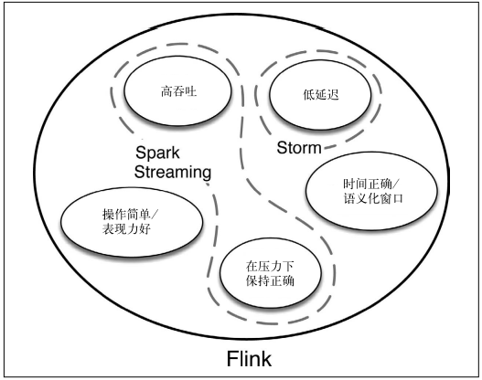

### 1.4 初探Flink

Apache Flink 是为分布式、高性能、随时可用以及准确的流处理应用程序打造的开源流处理框架。

Flink不仅能提供同时支持高吞吐和 exactly-once 语义的实时计算，还能提供批量数据处理

#### 流处理与批处理

Flink 将批处理（即处理有限的静态数据）视作一种特殊的流处理

Flink 分别提供了面向流处理的接口（DataStream API）和面向批处理的接口（DataSet API）。因此，Flink 既
可以完成流处理，也可以完成批处理。

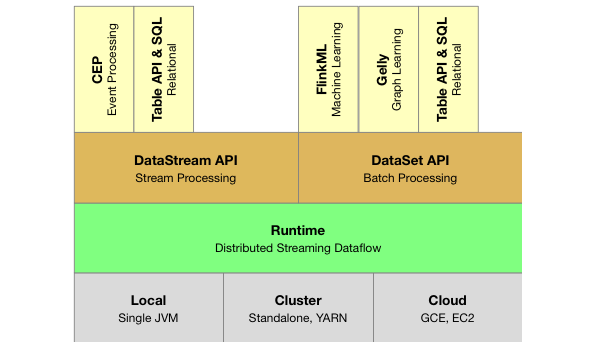

Flink 提供了封装在 Runtime执行引擎之上的 API，以帮助用户更方便地生成流式计算程序。Flink 提供了用于流处理的 DataStream API 和用于批处理的 DataSet API。值得注意的是，尽管 Flink Runtime 执行引擎是基于流处理的，但是 DataSet API 先于DataStream API 被开发出来，这是因为工业界对无限流处理的需求在 Flink诞生之初并不大。

Flink 能够自动地确保在发生机器故障或者其他错误时计算能持续进行，或者在修复 bug 或进行版本升级后有计划地再执行一次。

### 1.5 生产环境中的Flink

阿里巴巴集团

### 1.6 Flink的适用场景

与其说流数据是特别的，倒不如说它是自然的——只不过从前我们没有流处理能力，只能做一些特殊的处理才能
真正地使用流数据，比如将流数据攒成批量数据再处理，不然无法进行大规模的计算。使用流数据并不新鲜，新鲜的是我们有了新技术，从而可以大规模、灵活、自然和低成本地使用它们。

## 第2章 流处理架构

Flink 扩展了“流处理”这个概念的范围。有了它，流处理不仅指实时、低延迟的数据分析，还指各类数据应用程序。其中，有些应用程序基于流处理器实现，有些基于批处理器实现，有些甚至基于事务型数据库实现。

### 2.1 传统架构与流处理架构

**传统架构**

1. 对于后端数据而言，典型的传统架构是采用一个中心化的数据库系统，该系统用于存储事务性数据。换句话说，数据库（SQL 或者 NoSQL）拥有“新鲜”（或者说“准确”）的数据，这些数据反映了当前的业务状态。需要新鲜数据的应用程序都依靠数据库实现。
2. 分布式文件系统则用来存储不需要经常更新的数据，它们也往往是大规模批量计算所依赖的数据存储方式。

随着大型分布式系统中的计算复杂度不断上升，经常遇到以下问题：

- 在许多项目中，从数据到达到数据分析所需的**工作流程太复杂、太缓慢**。
- **数据库是唯一正确的数据源**，每一个应用程序都需要通过访问数据库来获得所需的数据。
- 采用这种架构的系统拥有**非常复杂的异常问题处理方法**，当出现异常问题时，很难保证系统还能很好地运行。
- 需要通过**在大型分布式系统中不断地更新来维持一致的全局状态**，随着系统规模扩大，维持实际数据与状态数据间的一致性变得越来越困难。流处理架构则少了对这方面的要求，只需要维持本地的数据一致性即可。

**流处理架构**

1. 以流为基础的架构设计让数据记录持续地从数据源流向应用程序，并在各个应用程序间持续流动。
2. 没有一个数据库来集中存储全局状态数据，取而代之的是共享且永不停止的流数据，它是唯一正确的数据源，记录了业务数据的历史。
3. 在流处理架构中，每个应用程序都有自己的数据，这些数据采用本地数据库或分布式文件进行存储。

### 2.2 消息传输层和流处理层

**消息传输层**从各种数据源（生产者）采集连续事件产生的数据，并传输给订阅了这些数据的应用程序和服务（消费者）。

**流处理层**有 3 个用途：

- 持续地将数据在应用程序和系统间移动；
- 聚合并处理事件；
- 在本地维持应用程序的状态。

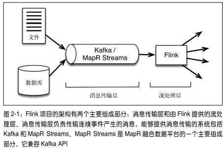

在设计高效的流处理架构时，不仅流处理器的选择会造成架构的巨大差异，消息传输层也很关键。现代系统之所以更容易处理大规模的流数据，其中很大一部分原因就是消息传输方式的改进，以及流处理器与消息传输系统的交互方式的改变。

### 2.3 消息传输层的理想功能

#### 2.3.1 兼具高性能和持久性

为了设计新一代的流处理架构，兼具高性能和持久性对于消息传输系统来说至关重要。

消息传输层的一个作用是作为流处理层上游的安全队列——它相当于缓冲区，可以将事件数据作为短期数据保留起来，以防数据处理过程发生中断。

具有持久性的好处之一是消息可以重播，这个功能使得像 Flink 这样的处理器能对事件流中的某一部分进行重播和再计算

正是由于消息传输层和流处理层相互作用，才使得像 Flink 这样的系统有了准确处理和“时空穿梭”（指重新处理数据的能力）的保障，认识到这一点至关重要。

#### 2.3.2 将生产者和消费者解耦

高效的消息传输技术，可以从多个源（生产者）收集数据，并使这些数据可供多个服务或应用程序（消费者）使用。

事件数据只能基于给定的偏移量从消息队列中按顺序读出。生产者并不向所有消费者自动广播。这一点听起来微不足道，但是对整个架构的工作方式有着巨大的影响。

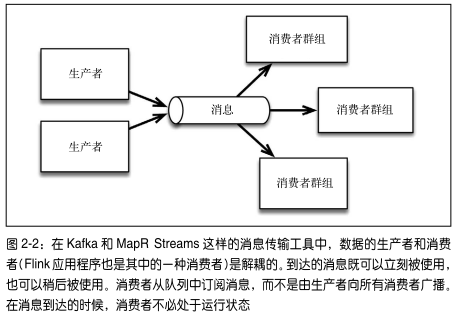

消费者订阅感兴趣的主题——意味着消息立刻到达，但并不需要被立刻处理。在消息到达时，消费者并不需要处于运行状态，而是可以根据自身的需求在任何时间使用数据。这样一来，添加新的消费者和生产者也很容易。

采用解耦的消息传输系统很有意义，因为它能支持微服务，也支持将处理步骤中的实现过程隐藏起来，从而允许自由地修改实现过程。

### 2.4 支持微服务架构的流数据

**什么是微服务**

- 微服务方法指的是将大型系统的功能分割成通常具有单一目的的简单服务，从而使小型团队可以轻松地构建和维护这些服务。
- 即使是超大型组织，也可以用这种设计实现敏捷。
- 若要使整个系统正常工作，各服务之间因通信而产生的连接必须是轻量级的。

消息传输系统一方面将生产者和消费者解耦，另一方面又有足够高的吞吐量，并且能够满足像 Flink 这样的高性能流处理器。这种系统非常适合用于构建微服务。

#### 2.4.1 数据流作为中心数据源

- 流处理架构的核心是使各种应用程序互连在一起的消息队列，流处理器从消息队列中订阅数据并加以处理。
- 处理后的数据可以流向另一个消息队列，这样一来，其他应用程序（包括其他 Flink 应用程序）都可以共享流数据。
- 在一些情况下，处理后的数据会被存放在本地数据库中。

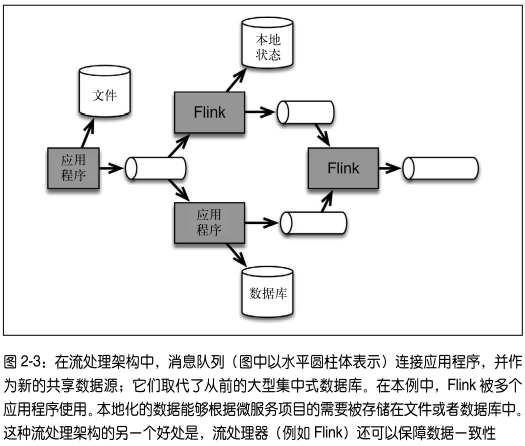

#### 2.4.2 欺诈检测：流处理架构用例

基于流处理的微服务架构有着强大的灵活性，特别是当同一份数据被用于不同的场景时，其灵活性更为明显。

以信用卡服务提供商的欺诈检测项目为例。项目的目标是尽可能快地识别可疑的刷卡行为，从而阻止盗刷，并
将损失降到最低。

许多销售终端（POS 机 1~n）请求欺诈检测器判定是否有欺诈行为。这些来自销售终端的询问需要立即被应答，因此在销售终端与欺诈检测器之间形成了询问与应答的交互。

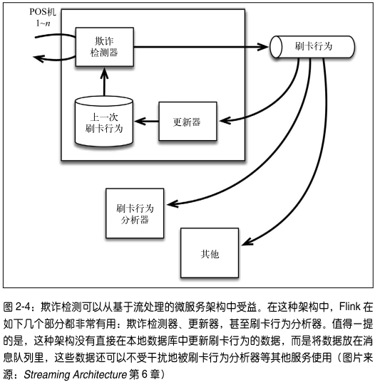

**传统的欺诈检测模型**

将包含每张信用卡最后一次刷卡地点的文件直接存储在数据库中。但在这样的集中式数据库设计中，

- 其他消费者并不能轻易使用刷卡行为的数据，因为访问数据库可能会影响欺诈检测系统的正常工作；
- 在没有经过认真仔细的审查之前，其他消费者绝不会被授权更改数据库。

这将导致整个流程变慢，因为必须仔细执行各种检查，以避免核心的业务功能受到破坏或影响。

**流处理架构**

将欺诈检测器的输出发送给外部的消息队列，再由如 Flink 这样的流处理器更新数据库，而不是直接将输出发送给数据库。

这使得刷卡行为的数据可以通过消息队列被其他服务使用，例如刷卡行为分析器。上一次刷卡行为的数据被存储在本地数据库中，不会被其他服务访问。这样的设计避免了因为增加新的服务而带来的过载风险。

#### 2.4.3 给开发人员带来的灵活性

假设开发团队正试图改进欺诈检测模型并加以评估。

- 刷卡行为产生的消息流可以被新模型采用，而完全不影响已有的检测器。
- 新增加一个数据消费者的开销几乎可以忽略不计，同时只要合适，数据的历史信息可以保存成任何一种格式，并且使用任意的数据库服务。
- 如果刷卡行为队列中的消息被设计成业务级别的事件，而不是数据库表格的更新，那么消息的形式和内容都会非常稳定。

### 2.5 不限于实时应用程序

**实时仪表盘**：虽然低延迟性很重要，但是实时应用程序只是众多流数据消费者中的一种。流数据的应用很广泛，比如，流处理应用程序可以通过订阅消息队列中的流数据来实时更新仪表盘（如图 2-5 中的 A 组消费者）。

**消息重播**：持久化的消息可以被重播，这一特性使许多用户获益（如图 2-5 中的 C 组消费者）。在本例中，消息流成为了可审计的日志，或者长期的事件历史。能够重现的历史非常有用，比如可以在工业安全分析中作为预知维护模型的一部分输入，也可以在医学或环境科学领域用于回顾性研究。

**聚合分析**：应用程序使用消息队列中的数据更新本地数据库或者搜索文件（如图 2-5 中的 B 组消费者）。消息队列中的数据往往必须被流处理器聚合或者分析并转换之后，才会输出到数据库中。这是 Flink 擅长的另一个场景。

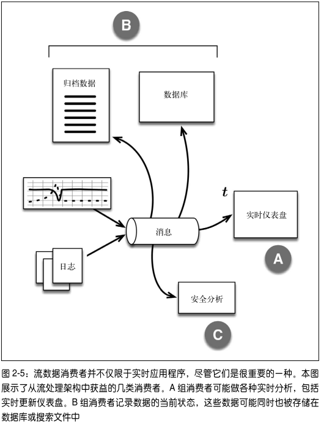

### 2.6 流的跨地域复制

1. 许多关键的业务系统依靠跨数据中心的一致性，它们不仅需要高效的流处理层，更需要消息传输层拥有可靠的跨地域复制能力。
2. 数据中心之间的数据复制需要保存消息偏移量，因为它使得任何数据中心的更新都可以被传播到其他数据中心，且允许双向和循环的数据复制。如果消息偏移量没有被保存，那么另一个数据中心就无法可靠地重启程序。
3. 如果不允许其他数据中心更新数据，那么就必须设计可靠的主节点。
4. 循环复制则可以避免复制过程出现单点故障。

**MapR Streams**

MapR Streams 循环复制的基本原理：

1. 许多流主题被收集在一级数据结构中，该结构也叫作流，它与文件、表格和目录共存于 MapR 的数据平台
2. 这些流成为管理数据复制、生存时间和访问权限的基础
3. 在流中针对主题所做的变更将被贴上源集群的 ID，避免它被无限地循环复制
4. 这些变更被依次传播到其他集群中，并且保留所有的消息偏移量

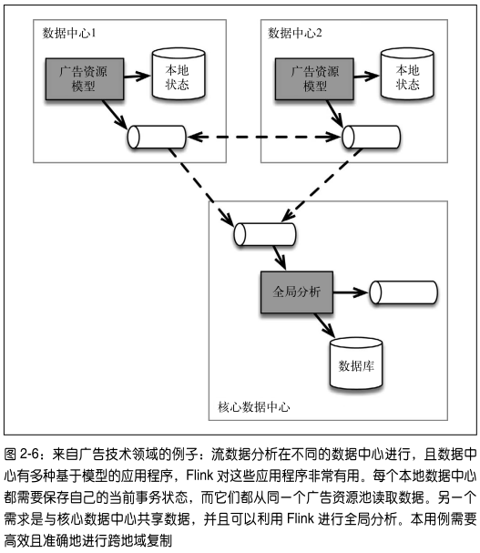

## 第3章 Flink的用途

### 3.1 不同类型的正确性

#### 3.1.1 符合产生数据的自然规律

流处理器（尤其是 Flink）的正确性体现在计算窗口的定义符合数据产生的自然规律

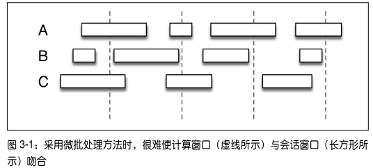

由微批处理方法得到的计算窗口是人为设置的，因此很难与会话窗口吻合。使用 Flink 的流处理 API，可以更灵活地定义计算窗口，因此这个问题迎刃而解。

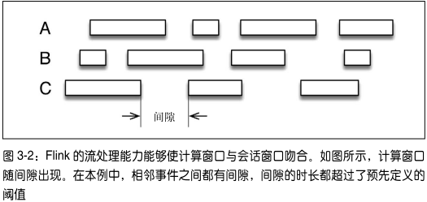

Flink 能做到这一点的根本原因是，它可以根据真实情况设置计算窗口。

#### 3.1.2 事件时间

一般而言，流处理架构不常采用事件时间，Flink 能够完美地做到这一点，这在实现计算的正确性上非常有用。为了获得最佳的计算结果，系统需要能够通过数据找到事件发生的时间，而不是只采用处理时间。

使用一个 Flink 程序来计算以 1秒为计算窗口、每秒内正弦波的数值之和。正确的结果是 0。他比较了用处理时间划分窗口和用事件时间划分窗口的差别。采用处理时间时，结果总是或多或少地有些偏差；采用事件时间时，则总是可以获得正确的结果。

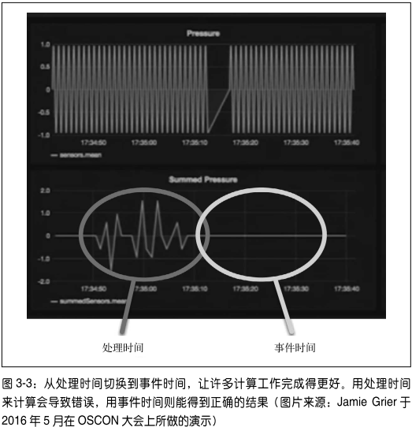

与其他流处理系统相比，Flink 的一个优势就是能区分不同类型的时间。

#### 3.1.3 发生故障后仍保持准确

**状态**

1. 若想使计算保持准确，就必须跟踪计算状态。如果计算框架本身不能做到这一点，就必须由应用程序的开发人员来完成这个任务。
2. 连续的流处理很难跟踪计算状态，因为计算过程没有终点。实际上，对状态的更新是持续进行的

**检查点（checkpoint）**

1. 在每个检查点，系统都会记录中间计算状态，从而在故障发生时准确地重置。
2. 这一方法使系统以低开销的方式拥有了容错能力——当一切正常时，检查点机制对系统的影响非常小。
3. 检查点也是 Flink 能够按需重新处理数据的关键所在。毕竟，并不是只有在发生故障之后才会重新处理数据。比如，在运行新模型或者修复 bug 时，就可能需要重播并重新处理事件流数据。
4. Flink 的检查点特性在流处理器中是独一无二的，它使得Flink 可以准确地维持状态，并且高效地重新处理数据。

#### 3.1.4 及时给出所需结果

有些计算结果或许很准确，但是如果没有及时地取得结果，那么很难说它们是正确的，比如程序需要2个小时才能将实时路况结果返回，那么结果再准确也是无用的，哪怕只有 5 秒钟的延迟也足以造成麻烦，因为你可能已经拐错了弯。

可见，在某些情况下，极低的延迟非常重要，它决定了系统能够及时地给出所需结果，而不仅仅是完成计算。Flink 的实时且容错的流处理能力可以满足这类需求。

#### 3.1.5 使开发和运维更轻松

1. Flink 与用户交互的接口也有助于保障正确性，完备的语义简化了开发工作，进而降低了出错率
2. Flink 还承担了跟踪计算状态的任务，从而减轻了开发人员的负担，简化了编程工作，并提高了应用程序的成功率
3. 用同一种技术来实现流处理和批处理，大大地简化了开发和运维工作。

### 3.2 分阶段采用Flink

1. 尽管 Flink 拥有非常丰富的功能，并能处理极为复杂的数据，但是没有必要为了采用 Flink 而彻底抛弃其他技术。
2. 流处理架构可以分步来实现，先实现简单的应用程序，等到熟悉后再推广。

## 第4章 对时间的处理

## 第5章 有状态的计算

## 第6章 批处理：一种特殊的流处理

## 附录 其他资源