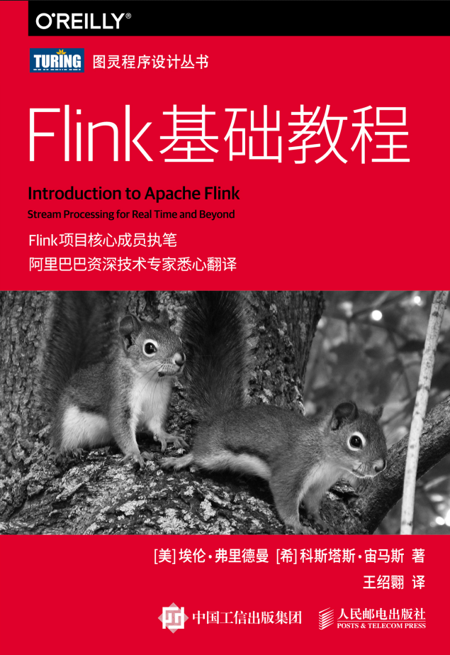

## [Introduction to Apache Flink](./Introduction%20to%20Apache%20Flink)

### [第1章 为什么选择Flink](./Introduction%20to%20Apache%20Flink/README.md#第1章-为什么选择flink)
### [第2章 流处理架构](./Introduction%20to%20Apache%20Flink/README.md#第2章-流处理架构)
### [第3章 Flink的用途](./Introduction%20to%20Apache%20Flink/README.md#第3章-flink的用途)
### [第4章 对时间的处理](./Introduction%20to%20Apache%20Flink/README.md#第4章-对时间的处理)
### [第5章 有状态的计算](./Introduction%20to%20Apache%20Flink/README.md#第5章-有状态的计算)
### [第6章 批处理：一种特殊的流处理](./Introduction%20to%20Apache%20Flink/README.md#第6章-批处理一种特殊的流处理)
### [附录 其他资源](./Introduction%20to%20Apache%20Flink/README.md#附录-其他资源)

### [思维导图](./Introduction%20to%20Apache%20Flink/Introduction%20to%20Apache%20Flink.pdf)

• 第 1 章是概述。我们在其中概括了状态化流处理、数据处理应用的架构和设计，以及流处理与传统方法相比的优势所在。此外，还简要介绍了如何在本地Flink 实例上运行你的第一个流式应用。

• 第 2 章主要讨论流处理的基本概念和挑战。这些内容均是独立于 Flink 而存在的。

• 第 3 章重点描述 Flink 的系统架构和内部实现。其中讨论了分布式架构、流式应用中的时间和状态处理问题以及Flink 的容错机制。

• 第 4 章讲解如何配置用于开发和调试 Flink 应用的环境。

• 第 5 章介绍 Flink DataStream API 的基础知识。你将从中学到如何实现DataStream 应用以及Flink 所支持的流式转换、函数及数据类型等。

• 第 6 章讨论 DataStream API 中基于时间的算子。其中包含窗口算子、基于时间的Join 以及一系列处理函数（process function），它们让流式应用中的时间处理变得十分灵活。

• 第 7 章介绍如何实现有状态函数以及一些与之相关的问题，例如性能、健壮性、有状态函数的演变等。同时本章还会展示如何使用Flink 的可查询式状态。

• 第 8 章介绍 Flink 中最常用的数据源（data source）和数据汇（data sink）连接器。其中会讨论Flink 中解决端到端应用一致性的方案以及如何实现自定义连接器来读写外部系统。

• 第 9 章讨论如何针对不同环境搭建和配置 Flink 集群。

• 第 10 章主要涵盖针对 7×24 小时运行的流处理应用的操作、监控和运维等内容。